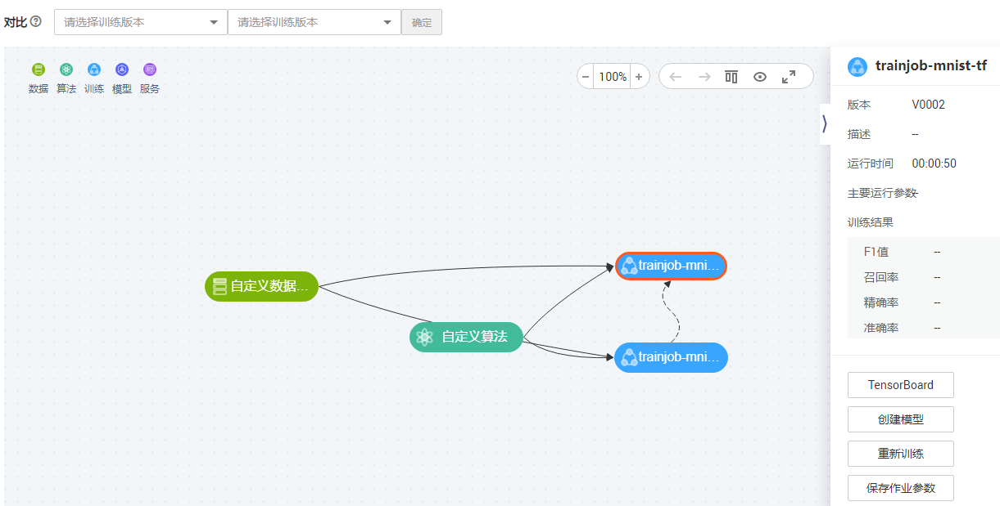
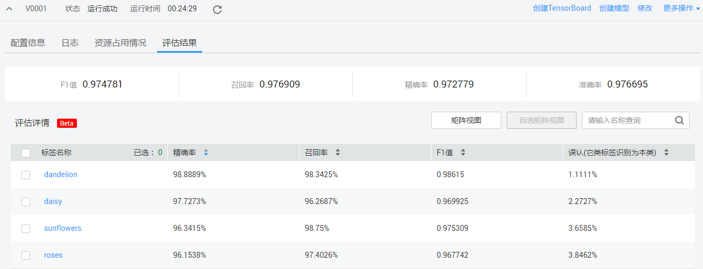
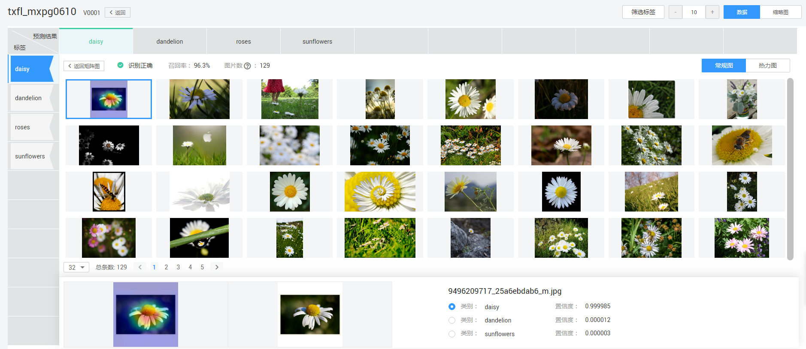

# 查看作业详情

训练作业运行结束后，除了管理训练作业版本之外，您可以通过查看[训练作业详情](#section15518121114018)、查看[溯源图](#section0238175012512)、查看[评估详情](#section106351621184712)，判断此训练作业是否满意。

## 训练作业详情

在ModelArts管理控制台，选择“训练作业“，进入训练作业列表页面。在训练作业列表中，您可以单击作业名称，查看该作业的详情。

每个版本的训练作业，包含的信息如[表1](#table43451384323)所示。

**图 1**  训练作业详情  

**表 1**  训练作业详情

<table><thead align="left"><tr id="row2034518103212"><th class="cellrowborder" valign="top" width="25.47%" id="mcps1.2.3.1.1">
参数

</th>
<th class="cellrowborder" valign="top" width="74.53%" id="mcps1.2.3.1.2">
说明

</th>
</tr>
</thead>
<tbody><tr id="row53454816321"><td class="cellrowborder" valign="top" width="25.47%" headers="mcps1.2.3.1.1 ">
V002

</td>
<td class="cellrowborder" valign="top" width="74.53%" headers="mcps1.2.3.1.2 ">
训练作业版本，由系统自动定义，命名规则为V001、V002。

</td>
</tr>
<tr id="row734616817324"><td class="cellrowborder" valign="top" width="25.47%" headers="mcps1.2.3.1.1 ">
状态

</td>
<td class="cellrowborder" valign="top" width="74.53%" headers="mcps1.2.3.1.2 ">
训练作业的状态。包含“部署中”、“运行中”、“运行成功”、“运行失败”、“已取消”。

</td>
</tr>
<tr id="row334613818321"><td class="cellrowborder" valign="top" width="25.47%" headers="mcps1.2.3.1.1 ">
运行时间

</td>
<td class="cellrowborder" valign="top" width="74.53%" headers="mcps1.2.3.1.2 ">
训练作业的运行时长。

</td>
</tr>
<tr id="row183463814327"><td class="cellrowborder" valign="top" width="25.47%" headers="mcps1.2.3.1.1 ">
配置信息

</td>
<td class="cellrowborder" valign="top" width="74.53%" headers="mcps1.2.3.1.2 ">
指当前训练作业版本的参数详情。

</td>
</tr>
<tr id="row5305850113216"><td class="cellrowborder" valign="top" width="25.47%" headers="mcps1.2.3.1.1 ">
日志

</td>
<td class="cellrowborder" valign="top" width="74.53%" headers="mcps1.2.3.1.2 ">
指当前训练作业版本的运行日志。如果您在参数中设置了“作业日志路径”，您可以在“日志”页签单击“下载”将存储在OBS桶中的日志下载到本地。

</td>
</tr>
<tr id="row430617506324"><td class="cellrowborder" valign="top" width="25.47%" headers="mcps1.2.3.1.1 ">
资源占用情况

</td>
<td class="cellrowborder" valign="top" width="74.53%" headers="mcps1.2.3.1.2 ">
指当前训练作业版本的资源使用情况，资源包括CPU、GPU和内存。

</td>
</tr>
<tr id="row759817083311"><td class="cellrowborder" valign="top" width="25.47%" headers="mcps1.2.3.1.1 ">
评估结果

</td>
<td class="cellrowborder" valign="top" width="74.53%" headers="mcps1.2.3.1.2 ">
展示当前训练作业的评估结果，详细参数说明请参见<a href="#section106351621184712">评估结果</a>。

</td>
</tr>
</tbody>
</table>

## 溯源图

在训练作业列表中，单击作业名称即可进入训练作业详情页面。默认进入“版本管理“页面，单击“溯源图“页签查看溯源图。

在“溯源图“页面中，您可以查看当前训练作业的数据、算法、训练、模型及服务之间的溯源图，并且您可以选择2个不同版本的训练作业进行对比。

在溯源图区域，选择任意一个元素，在界面右侧将展示此元素的详细信息，同时，还展示针对此元素您可以执行的下一步操作。例如当前选中的训练作业，右侧显示此训练作业的详细参数，并支持“创建TensorBoard“、“创建模型“、“重新训练“和“保存作业参数“的快捷操作。

**图 2**  查看溯源图  

## 评估结果

在ModelArts管理控制台，选择“训练作业“，进入训练作业列表页面。训练作业运行成功后，您可以单击作业名称，进入“版本管理“页面，单击“评估结果“页签，查看训练作业的评估结果详情。包含标签列表、矩阵视图入口和自选矩阵视图入口，支持根据标签名称进行搜索查询。详细介绍请参见[表2](#table164521625151610)。

**图 3**  评估结果页  

**表 2**  评估结果页内容介绍

<table><thead align="left"><tr id="row545319253160"><th class="cellrowborder" valign="top" width="27.810000000000002%" id="mcps1.2.3.1.1">
功能模块

</th>
<th class="cellrowborder" valign="top" width="72.19%" id="mcps1.2.3.1.2">
说明

</th>
</tr>
</thead>
<tbody><tr id="row3453122561617"><td class="cellrowborder" valign="top" width="27.810000000000002%" headers="mcps1.2.3.1.1 ">
标签列表

</td>
<td class="cellrowborder" valign="top" width="72.19%" headers="mcps1.2.3.1.2 ">
标签列表展示了“标签名称”、“精确率”、“召回率”、“F1值”和“误认”。

</td>
</tr>
<tr id="row44531025111615"><td class="cellrowborder" valign="top" width="27.810000000000002%" headers="mcps1.2.3.1.1 ">
矩阵视图

</td>
<td class="cellrowborder" valign="top" width="72.19%" headers="mcps1.2.3.1.2 ">
单击“矩阵视图”，进入矩阵视图页面，可查看结果详情。默认展示矩阵视图。

</td>
</tr>
<tr id="row1645310258160"><td class="cellrowborder" valign="top" width="27.810000000000002%" headers="mcps1.2.3.1.1 ">
自选矩阵视图

</td>
<td class="cellrowborder" valign="top" width="72.19%" headers="mcps1.2.3.1.2 ">
勾选目的标签，单击“自选矩阵视图”，查看目的标签结果详情。当无标签勾选时，“自选矩阵视图”为灰色状态。

</td>
</tr>
</tbody>
</table>

**标签详情**

在“评估结果“页，单击标签名称查看标签预测结果。标签详情页列举了标签信息、预测结果、误认来源和矩阵视图界面入口，如[图4](#fig2637185113526)所示。

**图 4**  标注详情页  

**表 3**  标签详情页内容介绍

<table><thead align="left"><tr id="row126371512526"><th class="cellrowborder" valign="top" width="29.220000000000002%" id="mcps1.2.3.1.1">
功能模块

</th>
<th class="cellrowborder" valign="top" width="70.78%" id="mcps1.2.3.1.2">
说明

</th>
</tr>
</thead>
<tbody><tr id="row763818518521"><td class="cellrowborder" valign="top" width="29.220000000000002%" headers="mcps1.2.3.1.1 ">
标签信息

</td>
<td class="cellrowborder" valign="top" width="70.78%" headers="mcps1.2.3.1.2 ">
该标签对应的“精确率”、“召回率”、“F1值”、“误认率”和“本标签图片数”。

</td>
</tr>
<tr id="row8638851185217"><td class="cellrowborder" valign="top" width="29.220000000000002%" headers="mcps1.2.3.1.1 ">
预测结果

</td>
<td class="cellrowborder" valign="top" width="70.78%" headers="mcps1.2.3.1.2 ">
预测的“标签名”、“图片数”和“占比”，支持图片数和占比的排序，按标签名搜索，预测结果可分页显示。

</td>
</tr>
<tr id="row12638125116529"><td class="cellrowborder" valign="top" width="29.220000000000002%" headers="mcps1.2.3.1.1 ">
误认来源

</td>
<td class="cellrowborder" valign="top" width="70.78%" headers="mcps1.2.3.1.2 ">
误认为是该标签的图片列表，单击图片，展示该图片的标签信息及预测结果。

</td>
</tr>
<tr id="row1763875195211"><td class="cellrowborder" valign="top" width="29.220000000000002%" headers="mcps1.2.3.1.1 ">
矩阵视图

</td>
<td class="cellrowborder" valign="top" width="70.78%" headers="mcps1.2.3.1.2 ">
单击标签名，进入矩阵视图界面。

</td>
</tr>
</tbody>
</table>

**矩阵视图**

矩阵视图页列举了标签矩阵视图展示、矩阵网格缩放、筛选标签和预测特征可视化界面入口功能模块。

1.  在“评估结果“页，您可以通过如下方式查看矩阵视图。
    -   查看所有标签矩阵视图
        -   在“评估结果“页，单击页面右侧“矩阵视图“进入矩阵视图页面，查看所有标签的详细信息。
        -   在“评估结果“页，单击目标标签名称，进入标签详情界面，单击界面右侧“矩阵视图“，查看所选标签的详细信息。

    -   查看目标标签矩阵视图
        -   在“评估结果“页，勾选目标标签名称后，单击“自选矩阵视图“进入自选矩阵视图页面，查看所选标签的详细信息。
        -   在“评估结果“页，单击目标标签名称，在标签详情界面，单击“预测结果“下的标签名称，查看所选标签的详细信息。

2.  进入矩阵视图页面，您可以进行标签筛选、设置本页展示标签数量、查看数据和缩略图等操作。

    **图 5**  矩阵视图页  
    

    -   标签矩阵视图：标签矩阵视图展示分为“数据“和“缩略图“两种方式。纵坐标为标签，横坐标为预测结果，矩阵式呈现结果（召回率和图片数）。
    -   筛选标签：单击右上角“筛选标签“，进入“筛选标签“页面。勾选对应标签和预测结果后，单击“确定“，返回矩阵视图页，通过筛选标签，可以改变矩阵图里“标签“和“预测结果“的关键词呈现量。
    -   矩阵网格：矩阵网格的横纵坐标可展示规格为10\*10、15\*15、20\*20的数据。您可以通过右上角区域进行操作。如果您筛选出来标签或预测结果的数大于可展示规格，那么您可以通过拉动右侧或下方的滚动条来查看其他标签或预测结果。

3.  在矩阵视图页面，可以在“数据“或“缩略图“页签单击不为空的网格，进入预测特征可视化界面。预测特征可视化界面分为标签预测基本信息、常规图和热力图列表、单张图片预测详情。
    -   标签预测基本信息：标签预测，显示识别结果、召回率和图片数。
    -   常规图和热力图列表：单击页面右侧“常规图“或“热力图“，通过选择标签和预测结果查看对应的常规图或热力图。
    -   单张图片预测详情：单击选中单张图片，页面下方显示该图片常规图和热力图，展示预测类别和置信度。

        **图 6**  预测特征可视化界面  
        

4.  在预测特征可视化界面，如果图片数量过多，您可以单击页面下方的下拉列表，选择该页面展示的图片数量。

