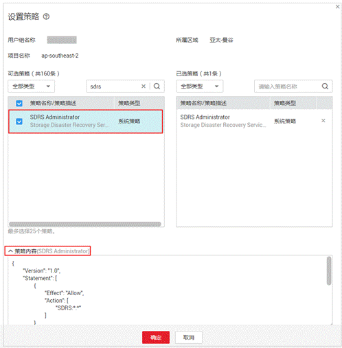

# 策略语法：RBAC<a name="modelarts_23_0082"></a>

## 策略结构<a name="section16899132910417"></a>

策略结构包括：策略版本号（Version）、策略授权语句（Statement）和策略依赖（Depends）。

**图 1**  策略结构<a name="fig86683014414"></a>  


## 策略语法<a name="section1590162924117"></a>

如下以SDRS服务的“SDRSAdministraor”为例，说明RBAC策略语法。



```
{ 
        "Version": "1.0", 
        "Statement": [ 
                { 
                        "Action": [ 
                                "SDRS:*:*" 
                        ], 
                        "Effect": "Allow" 
                } 
        ], 
        "Depends": [ 
                { 
                        "catalog": "BASE", 
                        "display_name": "Tenant Guest" 
                }, 
                { 
                        "catalog": "BASE", 
                        "display_name": "Server Administrator" 
                } 
        ] 
}
```

## 参数说明<a name="section56834929"></a>

-   Version：策略的版本号，RBAC策略版本为“1.0”，细粒度策略版本为“1.1”。
-   Statement：策略的授权语句，包含Action（授权项）和Effect（作用），Action和Effect结合构成用户具备的权限。
    -   Action（授权项）：操作权限，格式为：服务名:资源类型:操作

        "SDRS:\*:\*"：表示对SDRS的所有操作，其中SDRS为服务名；“\*”为通配符，表示对所有的资源类型可以执行所有操作。

    -   Effect（作用）：定义Action中的操作权限是否允许执行。Allow：允许；Deny：拒绝。

-   Depends：策略的依赖关系，给用户组授予该策略时，需要同时勾选依赖的权限，否则该策略不会生效。
    -   catalog：依赖的策略的所属服务。
    -   display\_name：依赖的策略的名称，“SDRSS Administraor”依赖Base服务的“Tenant Guest”和“Tenant Administrator”策略。


