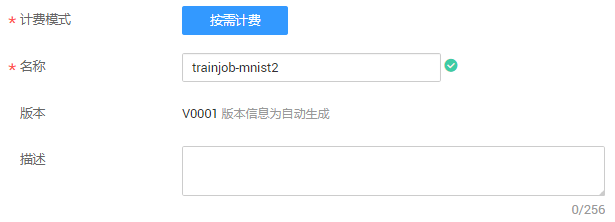
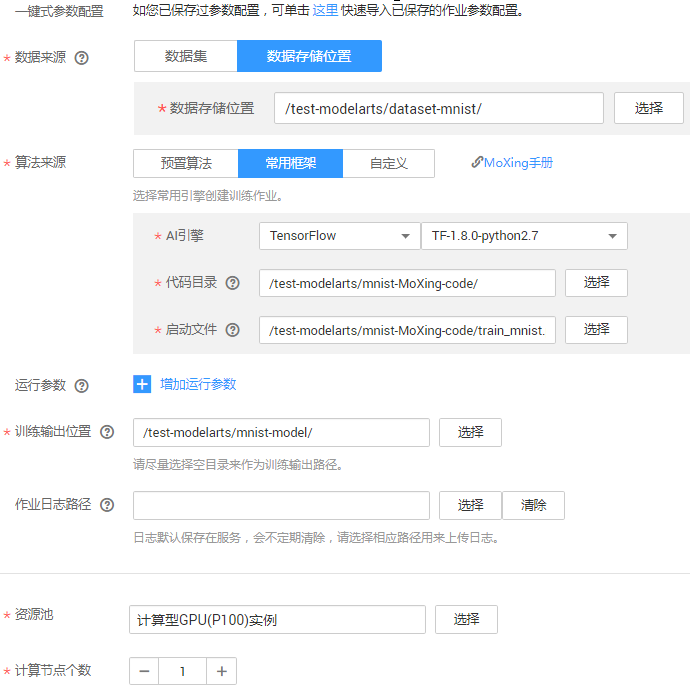
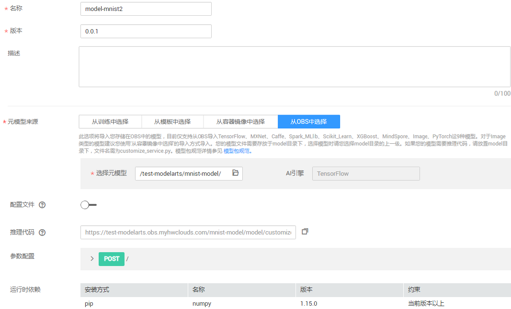
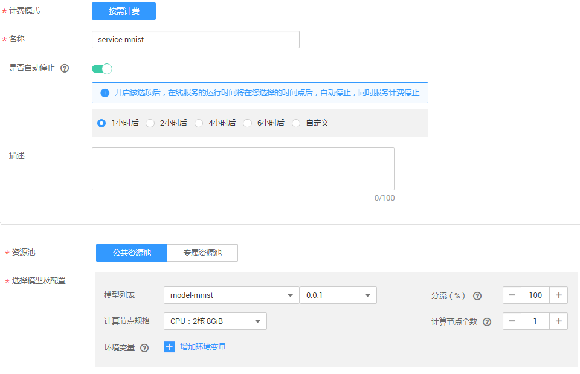
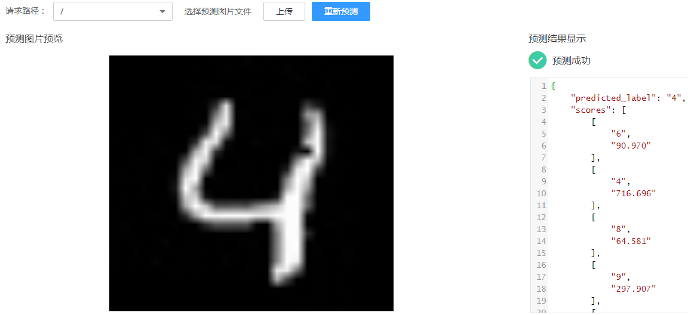

# 使用MoXing开发训练脚本，实现手写数字识别

本示例介绍在ModelArts平台如何使用MoXing实现MNIST数据集的手写数字图像识别应用。

开始使用如下样例前，请务必按[准备工作](https://support.huaweicloud.com/prepare-modelarts/modelarts_08_0001.html)指导完成必要操作。使用MoXing实现手写数字图像识别样例的操作流程如下所示。

1.  **[准备数据](#section336312088)**：获取MNIST数据集，并上传至OBS。
2.  **[训练模型](#section1710418164461)**：使用MoXing框架编模型训练脚本，并新建训练作业进行模型训练。
3.  **[部署模型](#section9958141119468)**：得到训练好的模型文件后，新建预测作业将模型部署为在线预测服务。
4.  **[验证模型](#section760652810462)**：发起预测请求获取预测结果。

## 准备数据

ModelArts在公共OBS桶中提供了MNIST数据集，命名为“Mnist-Data-Set“，因此，本文的操作示例使用此数据集进行模型构建。您需要执行如下操作，将数据集上传至您的OBS目录下，即准备工作中您创建的OBS目录“test-modelarts/dataset-mnist“。

1.  单击[数据集下载链接](https://modelarts-cnnorth1-market-dataset.obs.cn-north-1.myhuaweicloud.com/dataset-market/Mnist-Data-Set/archiver/Mnist-Data-Set.zip)，将“Mnist-Data-Set“数据集下载至本地。
2.  在本地，将“Mnist-Data-Set.zip“压缩包解压。例如，解压至本地“Mnist-Data-Set“文件夹下。
3.  参考[上传文件](https://support.huaweicloud.com/usermanual-obs/zh-cn_topic_0045829660.html)，使用批量上传方式将“Mnist-Data-Set“文件夹下的所有文件上传至“test-modelarts/dataset-mnist“OBS路径下。

    “Mnist-Data-Set“数据集包含的内容如下所示，其中“.gz“为对应的压缩包。

    -   “t10k-images-idx3-ubyte“：验证集，共包含10000个样本。
    -   “t10k-labels-idx1-ubyte“：验证集标签，共包含10000个样本的类别标签。
    -   “train-images-idx3-ubyte“：训练集，共包含60000个样本。
    -   “train-labels-idx1-ubyte“：训练集标签，共包含60000个样本的类别标签。

## 训练模型

数据准备完成后，您需要使用MoXing接口编写训练脚本代码，ModelArts提供了一个编写好的代码示例“train\_mnist.py“，如下操作使用此示例训练模型。

1.  从github下载[ModelArts-Lab](https://github.com/huaweicloud/ModelArts-Lab)工程，并在“ModelArts-Lab“工程的“\\ModelArts-Lab-master\\official\_examples\\Using\_MoXing\_to\_Create\_a\_MNIST\_Dataset\_Recognition\_Application\\codes“目录下获取模型训练脚本文件“train\_mnist.py“。
2.  将“train\_mnist.py“文件上传至OBS，例如“test-modelarts/mnist-MoXing-code“。
3.  在ModelArts管理控制台，进入“训练作业“页面，单击左上角的“创建“。
4.  在创建训练作业页面，参考[图1](#fig1748310525123)和[图2](#fig348317528128)填写相关信息，然后单击“下一步“。

    **图 1**  创建训练作业-基本信息  
    

    **图 2**  创建训练作业-详细参数  
    

5.  在“规格确认“页面，确认训练作业的参数信息，确认无误后单击“提交“。
6.  在训练作业管理页面，当训练作业变为“运行成功“时，即完成了模型训练过程。如有问题，可单击作业名称，进入作业详情界面查看训练作业日志信息。

    > **说明：**   
    >训练作业需要花费一些时间，预计十几分钟。当训练时间超过一定时间（如1个小时），请及时手动停止，释放资源。否则会导致欠费，尤其对于使用GPU训练的模型项目。  

7.  （可选）在模型训练的过程中或者完成后，可以通过创建可视化作业查看一些参数的统计信息。详细操作指导请参见[创建可视化作业](https://support.huaweicloud.com/engineers-modelarts/modelarts_23_0050.html)。

    其中，“训练输出位置“请选择训练作业中“训练输出位置“参数中的路径，如“/test-modelarts/mnist-model/“。根据界面提示完成可视化作业创建。

## 部署模型

模型训练完成后，将模型部署为在线预测服务。其中ModelArts提供了已编写好的推理代码“customize\_service.py“和配置文件“config.json“。

1.  从github下载[ModelArts-Lab](https://github.com/huaweicloud/ModelArts-Lab)工程，并在“ModelArts-Lab“工程的“\\ModelArts-Lab-master\\official\_examples\\Using\_MoXing\_to\_Create\_a\_MNIST\_Dataset\_Recognition\_Application\\codes“目录下获取推理代码“customize\_service.py“和配置文件“config.json“。
2.  将“customize\_service.py“和“config.json“文件上传至OBS中，需存储至OBS中训练作业生成模型的路径，例如“test-modelarts/mnist-model/model“。

    > **说明：**   
    >-   训练作业将在“训练输出位置“指定路径中新建一个“model“文件夹，用于存储生成的模型。  
    >-   推理代码和配置文件必须上传至“model“文件夹下。  

3.  在ModelArts管理控制台，单击左侧导航栏中的“模型管理\>模型列表“，进入“模型列表“页面，单击左上角“导入“。
4.  在“导入模型“页面，参考[图3](#fig1117910489486)填写相关参数，然后单击“立即创建“。

    在“元模型来源“中，选择“从OBS中选择“页签，然后在“选择元模型“选项中设置为训练作业中的“训练输出位置“指定的路径，不能设置为此路径下的“model“文件夹，否则系统无法自动找到模型及其相关文件。

    **图 3**  导入模型  
    

5.  在“模型列表“页面，当模型状态变更为“正常“时，表示模型已导入成功。您单击模型名称左侧的小三角，打开此模型下的所有版本。在对应版本所在行，操作列单击“部署\>在线服务“，将模型部署为在线服务。
6.  在“部署“页面，请参考[图4](#fig20614113342113)的示例填写参数，然后单击“下一步“。

    **图 4**  部署在线服务  
    

7.  在“规格确认“页面，确认信息无误后的，单击“提交“。
8.  在线服务创建完成后，系统自动跳转至“部署上线\>在线服务“页面。服务部署需要一定时间，耐心等待即可。当服务状态变为“运行中“时，表示服务部署成功。

## 验证模型

在线服务部署成功后，您可以进入在线服务，发起预测请求测试服务。

1.  在“在线服务“管理页面，单击在线服务名称，进入在线服务详情页面。
2.  在线服务详情页面中，单击“预测“页签，进入预测页面。
3.  在“选择预测图片文件“右侧，单击“上传“按钮，上传一张黑底白字的图片，然后单击“预测“。

    预测完成后，预测结果显示区域将展示预测结果，根据预测结果内容，可识别出此图片的数字是“4“。

    > **说明：**   
    >-   由于推理代码和配置文件中已指定图片要求，用于预测的图片，大小必须为“28px\*28px“，图片格式必须为“jpg“，且图片必须是黑底白字。  
    >-   建议不要使用数据集中自带的图片，可以使用Windows自带的画图工具绘制一张。  
    >-   如果是其他不符合格式的单通道图片，预测结果可能会存在偏差。  

    **图 5**  在线服务预测结果  
    

